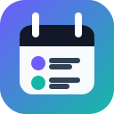
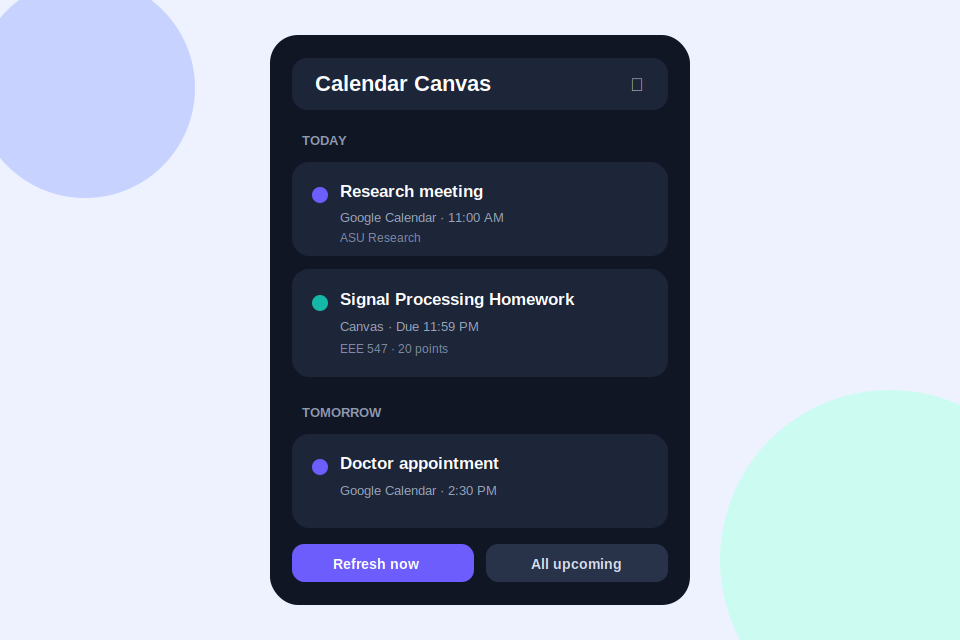

<p align="center">
  
</p>

<h1 align="center">Calendar Canvas Dashboard</h1>

<p align="center">
  An always-on-desktop dashboard that combines Google Calendar events and Canvas LMS deadlines on Windows and macOS.
</p>

<p align="center">
  <a href="#installation">Installation</a> ·
  <a href="#connect-canvas">Canvas setup</a> ·
  <a href="#connect-google-calendar">Google setup</a> ·
  <a href="#github-pages-website">GitHub Pages</a> ·
  <a href="#roadmap">Roadmap</a>
</p>



## What it does

Calendar Canvas Dashboard places upcoming meetings and academic deadlines in one compact desktop timeline. It currently supports:

- Upcoming events from the primary Google Calendar.
- Canvas assignments, quizzes, discussions, and planner items.
- Today, next seven days, and all-upcoming filters.
- Automatic refresh at a configurable interval.
- Click-through links to the original Google Calendar or Canvas item.
- Frameless and resizable desktop-widget layout.
- Optional always-on-top mode.
- Automatic launch at Windows or macOS login.
- Windows installer and macOS DMG build targets.

The current release supports **one Google account and one Canvas account**. Multiple-account support is on the roadmap.

## Why it is useful

Students and researchers often manage time in Google Calendar while coursework and deadlines remain in Canvas. Checking both systems repeatedly creates unnecessary friction and makes it easier to overlook an assignment.

This dashboard helps by:

- Showing meetings and deadlines in one chronological view.
- Making today's workload visible without opening a browser.
- Helping users reserve study or research time around scheduled events.
- Reducing missed deadlines caused by switching between separate systems.
- Providing direct access to the source item whenever more detail is needed.

It is especially useful for university students, graduate researchers, teaching assistants, faculty, and online learners balancing academic and personal schedules.

## Privacy and security

- Google Calendar access is read-only.
- Canvas requests go directly from the application to the configured Canvas instance.
- The project contains no analytics, advertising, or external application server.
- Credentials and settings are stored locally using `electron-store`.

The current release is intended for personal use. Before distributing it broadly, secrets should be moved to operating-system-backed secure storage such as Windows Credential Manager or macOS Keychain. See [PRIVACY.md](PRIVACY.md) and [SECURITY.md](SECURITY.md).

## Requirements

- Windows 10/11 or a currently supported macOS release.
- Node.js 20 LTS or later.
- npm.
- A Canvas personal access token.
- A Google Cloud OAuth client configured as a **Desktop app**.

## Installation

### Run from source

```bash
git clone https://github.com/YOUR-USERNAME/calendar-canvas-dashboard.git
cd calendar-canvas-dashboard
npm install
npm start
```

You can also download the repository ZIP from GitHub, extract it, open a terminal in the extracted folder, and run the same `npm install` and `npm start` commands.

### Windows installer

Build on Windows:

```powershell
npm install
npm run dist:win
```

The installer is created in `dist/`.

If electron-builder reports that it cannot create symbolic links:

1. Stop the build with `Ctrl+C`.
2. Enable **Windows Settings → System → For developers → Developer Mode**, or open PowerShell as Administrator.
3. Clear the incomplete signing cache:

```powershell
Remove-Item "$env:LOCALAPPDATA\electron-builder\Cache\winCodeSign" -Recurse -Force -ErrorAction SilentlyContinue
```

4. Run `npm run dist:win` again.

### macOS installer

A macOS DMG should be built on a Mac:

```bash
npm install
npm run dist:mac
```

Architecture-specific builds:

```bash
npm run dist:mac:arm       # Apple Silicon
npm run dist:mac:intel     # Intel
npm run dist:mac:universal # Intel + Apple Silicon
```

The DMG is created in `dist/`. For an unsigned personal build, Control-click the app in Finder and choose **Open** on the first launch. Do not disable Gatekeeper globally.

## Connect Canvas

1. Sign in to your Canvas site.
2. Open **Account → Settings**.
3. Scroll to **Approved Integrations**.
4. Select **New Access Token**.
5. Give the token a recognizable purpose, such as `Calendar Canvas Dashboard`.
6. Copy the token immediately.
7. Open the dashboard's **Settings**.
8. Enter the Canvas base URL, for example `https://canvas.asu.edu`.
9. Paste the token and save.
10. Refresh the dashboard.

Never post a Canvas token in an issue, screenshot, or source file. Token creation may be disabled by an institution's Canvas administrator.

## Connect Google Calendar

1. Create or select a project in Google Cloud Console.
2. Enable **Google Calendar API**.
3. Configure the OAuth consent screen.
4. For a personal project in Testing mode, add your Google account under **Audience → Test users**.
5. Create an OAuth client ID with application type **Desktop app**.
6. Download the credentials JSON.
7. Open dashboard **Settings** and paste the complete JSON contents.
8. Select **Connect Google**.
9. Complete authorization in the browser.

If Google displays `Error 403: access_denied`, verify that the exact account being used is listed as a test user in the same Google Cloud project as the downloaded OAuth credentials.

## Start automatically

Open dashboard **Settings** and enable **Start when computer turns on**.

- On Windows, the installed application is registered as a login item.
- On macOS, it can also be reviewed under **System Settings → General → Login Items**.

Startup works most reliably with an installed build rather than a project launched through `npm start`.

## Available commands

| Command | Purpose |
|---|---|
| `npm start` | Start the desktop application. |
| `npm run dev` | Start the application for local development. |
| `npm run dist:win` | Build a Windows NSIS installer. |
| `npm run dist:mac` | Build a DMG for the current Mac architecture. |
| `npm run dist:mac:arm` | Build for Apple Silicon. |
| `npm run dist:mac:intel` | Build for Intel Macs. |
| `npm run dist:mac:universal` | Build a universal macOS DMG. |


## Roadmap

- Multiple Google accounts and multiple Canvas accounts.
- Operating-system keychain storage for credentials.
- Native Windows and macOS notifications.
- Configurable reminders before deadlines.
- ICS export and calendar-feed tools.
- Course, calendar, and account color filters.
- Optional tray/menu-bar mode.
- Automated tests and accessibility improvements.

## Contributing

See [CONTRIBUTING.md](CONTRIBUTING.md). Issues and pull requests are welcome, but never include credentials or private calendar/course data.

## License

Released under the [MIT License](LICENSE).
